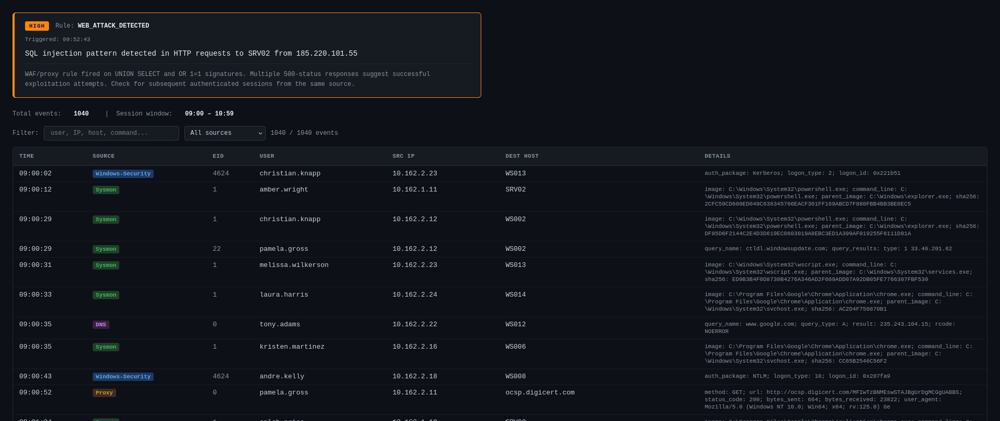

# 🛡️ SOC Analyst Simulator

A command-line training tool for SOC analysts. Generates realistic Windows/Sysmon/Proxy log streams, secretly injects an attack chain (or not — that's the challenge), fires a SIEM alert, and asks you to decide: **real incident or false positive?**

Built to train pattern recognition across the full MITRE ATT&CK kill chain — from reconnaissance to impact.

---

## Features

- **28 scenarios** — 16 INCIDENT + 12 False Positive
- **Full kill chain coverage** — recon, initial access, execution, persistence, privilege escalation, credential access, lateral movement, exfiltration, impact
- **Realistic log variety** — Windows Security events (EID 4624/4625/4688/4698/1102...), Sysmon (EID 1/3/11/22), Proxy, DNS
- **Anti-memorization** — TP and FP of the same type share the same SIEM rule ID (e.g. `AUTH_BRUTE_FORCE` fires for both real password spraying and an expired service account)
- **Randomized every run** — different company name, users, IPs, hostnames, command-line variants each session
- **MITRE ATT&CK links** — debrief includes clickable technique URLs
- **Export** — full log stream saved as CSV, NDJSON, or self-contained **HTML report** (open in any browser — includes the SIEM alert, full searchable/filterable log table, color-coded event sources)
- **Scoring** — points for correct verdict + time bonus

---

## Scenario Coverage

| Category | Scenarios |
|---|---|
| **INCIDENT** | APT29 Password Spraying → C2, FIN7 Spearphishing → Lateral Movement, Web SQLi → Exfiltration, Ransomware, Kerberoasting, DCSync, WMI Lateral Movement, LOLBins, RDP Brute Force, Insider Exfiltration, Pass-the-Hash, PowerShell Download Cradle, Scheduled Task C2, AV Disabled + Exfil, DNS Tunneling, Golden Ticket |
| **FALSE POSITIVE** | Morning Login Storm, Expired Service Account Password, Authorized Nessus Scan, Backup Agent (Veeam), Ansible Deployment, Windows Defender Full Scan, Developer API Testing, IT Admin AD Audit, WSUS Patch Deployment, SCCM Software Deployment, DNS First-Boot Provisioning, Helpdesk RDP Sessions |

---

## Installation

**Requirements:** Python 3.11+

```bash
git clone https://github.com/your-username/soc-simulator.git
cd soc-simulator
pip install -r requirements.txt
```

---

## Usage

### Basic run (random scenario)
```bash
python main.py
```

### With reproducible seed (same scenario + logs every time)
```bash
python main.py --seed 42
```

### Export as HTML report (open in browser)
```bash
python main.py --format html --output report.html
```

### Control log volume
```bash
python main.py --logs 1500
```

---

## Screen



---

## Session Example

```
+------------------------------------------------------------------------+
| SIEM ALERT  [HIGH]  —  Rule: AUTH_BRUTE_FORCE                          |
| Triggered: 10:33:07                                                    |
|------------------------------------------------------------------------|
| 15 failed logon attempts from 203.0.113.45 targeting                  |
| svc_backup@DC01 within 120 seconds                                     |
|                                                                        |
| Threshold rule fired: >10 EID 4625 from a single non-RFC1918 source   |
| IP. Possible password spraying. Review authentication events and       |
| subsequent activity for the same source.                               |
+------------------------------------------------------------------------+

TIMESTAMP  SOURCE           EID   USER                   SRC IP           DEST HOST
------------------------------------------------------------------------------------------
09:00:01   Sysmon           1     kate.morrison          10.14.2.11       WS001
09:00:04   Windows-Security 4624  john.smith             10.14.1.10       DC01
09:00:07   Proxy            0     kate.morrison          10.14.2.11       login.microsoftonline.com
...
  ... and 1016 more events

Log file: session.html  (1036 events total)

0 = FP  /  1 = INCIDENT: 1

=================================================================
  DEBRIEF
=================================================================

  Verdict:  ✓ INCIDENT (true: INCIDENT)
  Time:     47.3s
  Score:    150

  Attack phases injected:
    10:33:07  Reconnaissance: Port Scan           (8 events)
    10:34:45  Credential Access: Password Spraying (15 events)
    10:36:51  Initial Access: Valid Accounts       (1 events)
    10:37:10  Discovery: Domain Account Enum       (3 events)
    10:38:02  Execution: PowerShell                (4 events)
    10:39:18  Persistence: Scheduled Task          (1 events)
    10:39:27  C2: HTTP Beacon                      (5 events)

  MITRE ATT&CK techniques:
    T1595.002   Active Scanning            https://attack.mitre.org/techniques/T1595/002/
    T1110.001   Password Spraying          https://attack.mitre.org/techniques/T1110/001/
    T1078       Valid Accounts             https://attack.mitre.org/techniques/T1078/
    T1059.001   PowerShell                 https://attack.mitre.org/techniques/T1059/001/
    T1053.005   Scheduled Task             https://attack.mitre.org/techniques/T1053/005/
    T1071.001   Web Protocols (C2)         https://attack.mitre.org/techniques/T1071/001/

  Hint: Repeated 4625 from single external IP, then PowerShell recon
        and scheduled task creation — look at the source IP progression.
=================================================================
```

---

## Project Structure

```
soc-simulator/
├── main.py              # Entry point: CLI, orchestration, alert display
├── requirements.txt
├── LICENSE
│
├── scenarios/           # 28 YAML attack/FP scenario definitions
│   ├── apt29_brute_to_c2.yml
│   ├── ransomware.yml
│   ├── helpdesk_rdp_fp.yml
│   └── ...
│
├── sessions/            # Saved session results (JSON, gitignored)
│
└── src/                 # Core logic
    ├── models.py            # Dataclasses: LogEntry, WorldState, Scenario, etc.
    ├── world.py             # Virtual corporate environment builder (Faker)
    ├── generator.py         # Normal background log generation (~1000 events)
    ├── player.py            # Attack phase injection engine
    ├── session_builder.py   # Merges normal + attack logs, randomises timing
    ├── scenario_loader.py   # YAML scenario parser
    ├── exporter.py          # CSV / NDJSON / terminal output
    ├── scorer.py            # Verdict scoring + debrief printer
    └── log_factories/
        ├── windows_security.py  # EID 4624/4625/4634/4688/4698/4732/1102
        ├── sysmon.py            # EID 1/3/11/22 (process/network/file/dns)
        └── proxy.py             # HTTP requests, DNS lookups, web attacks, scans
```

---

## Adding Custom Scenarios

Create a YAML file in `scenarios/`:

```yaml
meta:
  name: "My Custom Attack"
  difficulty: medium          # easy / medium / hard
  answer: INCIDENT            # INCIDENT or FP
  mitre_techniques:
    - id: T1059.001
      name: "PowerShell"
  hint: "What to look for after answering"
  alert:
    rule_id: SUSPICIOUS_PROCESS
    severity: HIGH
    summary: "Unusual PowerShell execution on {inject_malicious_host}"
    description: "Longer description of what the rule detected."

world_overrides:
  attacker_ip: "203.0.113.99"
  inject_malicious_host: "WS007"
  inject_malicious_user: "john.doe"

phases:
  phase_1:
    name: "PowerShell Execution"
    technique: T1059.001
    count: 3
    log_factory: sysmon.process_create
    spread_seconds: 60
    delay_after_prev: [5, 20]
    params:
      dest_host: "{inject_malicious_host}"
      source_ip: "{attacker_ip}"
      command_line:
        - "powershell -w hidden -enc <base64>"
        - "powershell -nop -exec bypass -c IEX(...)"
```

Available `log_factory` values: `failed_logon`, `successful_logon`, `process_create`, `scheduled_task_created`, `log_cleared`, `account_added_to_group`, `sysmon.process_create`, `sysmon.network_connect`, `sysmon.dns_query`, `sysmon.file_create`, `proxy.http_request`, `proxy.web_attack`, `proxy.web_scan`

---

## Scoring

| Action | Points |
|---|---|
| Correct verdict (INCIDENT / FP) | +100 |
| Answer in under 3 minutes | +50 |
| Answer in 3–5 minutes | +25 |

Sessions are saved as JSON in `sessions/` for review.

---

## License

MIT
